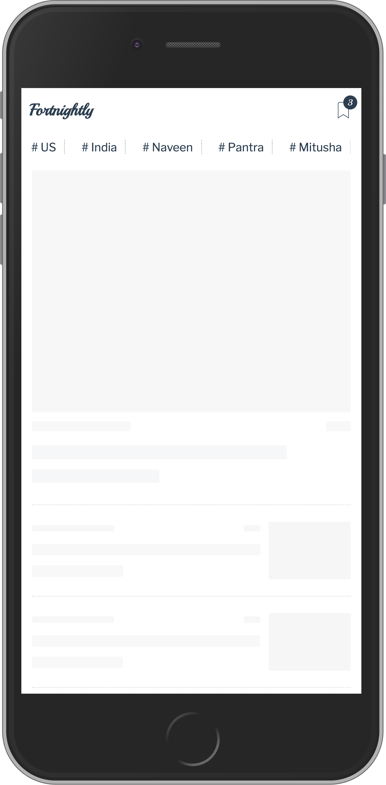
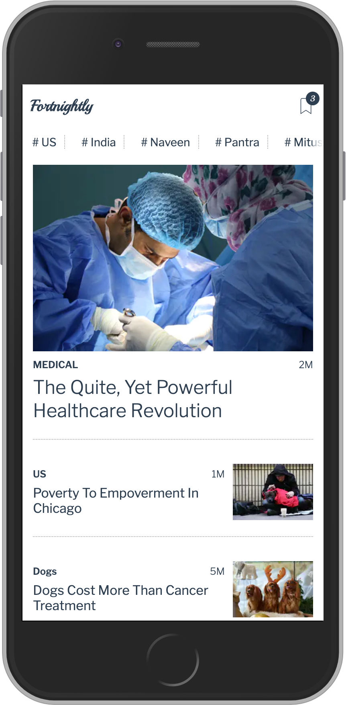
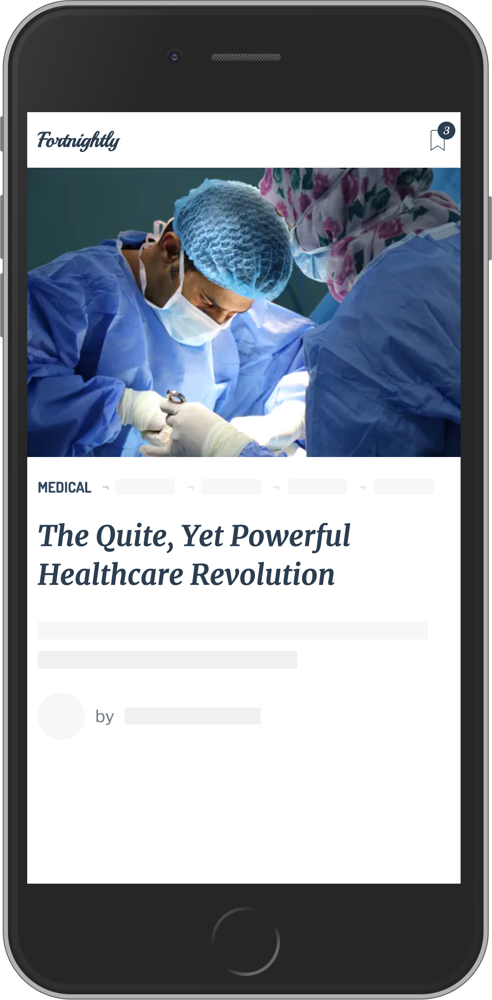
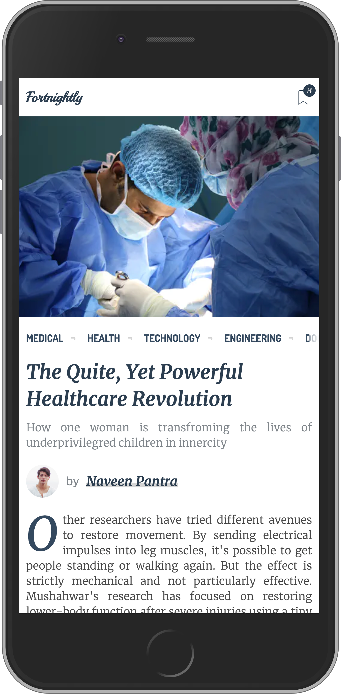
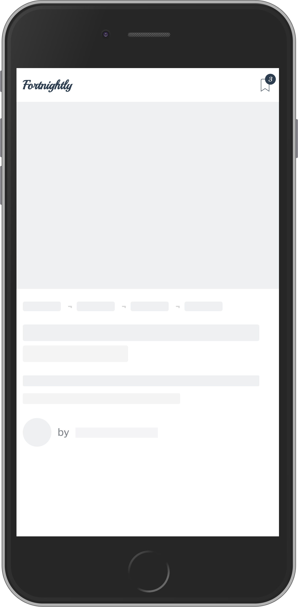

# Fortnightly

##### NOTE: This application is for practising purpose

#### Features

1. The data fetched in listing page (i.e home page ) is used in description page (i.e article page)
2. Used Preact, Redux/Redux Thunk for the project.
3. The API used the project are dummy they are simuleted using setTimeout.

#### ScreenShots

1. Home screen / Listing Page

   

       
       ==>
       
   

2. Navigation for Home screen to Article screen

   

       
       ==>
       
       ==>
       
   

3. Article Page

   

       
       ==>
       
   

#### Steps to run

clone the project and run `npm install` after installation run `npm start` it will automatically open the browser with url `localhost:3000` the project will be visible there.
